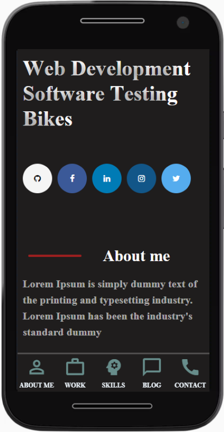

# Projekt — Wizytówka / Portfolio

Projekt zawiera szablon strony internetowej, która przedstawia wizytówkę/portfolio.
#### Link do strony: https://mariusz-sm.github.io/CodersCamp2020.Project.HTML-CSS.BusinessCard/

## Technologie
W projekcie zostały użyte następujące technologie:
- HTML
- CSS

## Zakres funkcjonalności

### Responsive Web Design

Strona dopasowuje się do urządzenia na którym jest wyświetlana, tak aby była ciągle czytelna. Poza tym przy małych rozdzielczościach używany jest pasek nawygacyjny dostosowany do takich urządzeń.

- Wygląd strony na PC

- Wygląd storny na urządzeniu mobilnym

### Formularz

### Animacja keyframes

Do nagłówka została dodana animacja keyframes. Litery zmieniają swoje położenie oraz przeźroczystość. 

### Ikony i czcionki

Podczas tworzenia strony zostały wykorzystane ikony i czcionki znajdujące się w poniższych lokalizacjach:
- https://fonts.googleapis.com/css?family=Castoro
- https://cdnjs.cloudflare.com/ajax/libs/font-awesome/4.7.0/css/font-awesome.min.css
- https://fonts.googleapis.com/icon?family=Material+Icons

### Sekcje

Do pozycjonowania elementów w sekcjach został użyty flexbox oraz grid. Poza tym zostały dodane efekty hover oraz transform.

